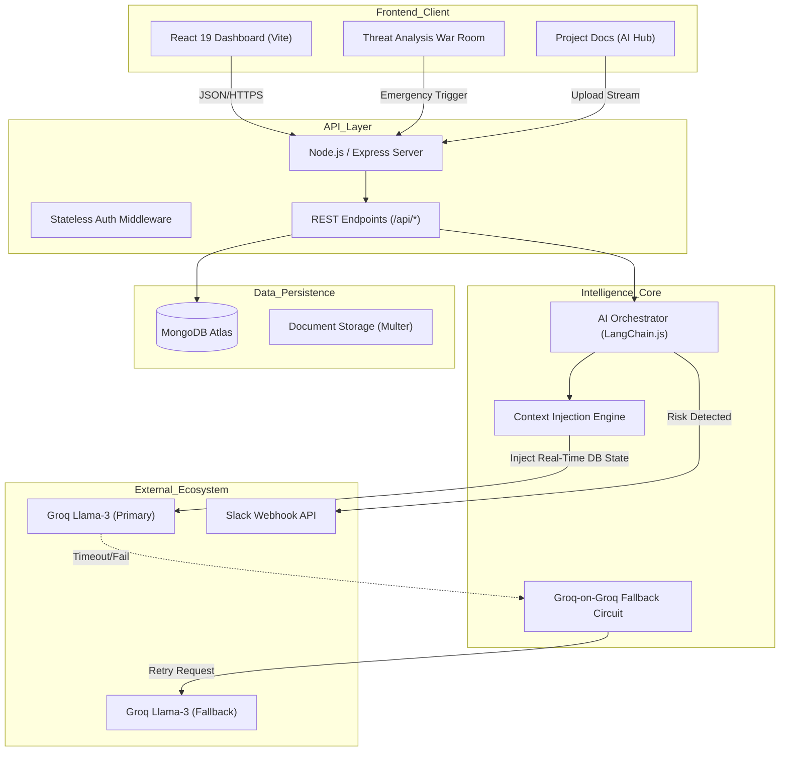

# 🏗️ PM AI Agent: Architecture & System Design

> **Version:** 1.1.0 (Hackathon Release - Tier 1 & 2 Complete)
> **Stack:** React 19, Node.js (Express), MongoDB, LangChain.js, Groq Llama-3
> **Key Innovation:** Context-Aware "Connected Brain" with Autonomous Risk Detection

---

## 🧩 High-Level System Architecture

The PM AI Agent acts as a central intelligence layer between raw project data and the project team. It is designed as an **Event-Driven Monolith**, optimized for low-latency AI interactions and modular scalability.



---

## 🛡️ Resilience Strategy: The "Groq-on-Groq" Fallback

To ensure 99.9% uptime for the AI features without the latency penalties of switching providers, we implemented a specialized fallback chain.

*   **The Problem:** API rate limits or transient outages from a single AI provider can crash the user experience.
*   **Our Solution:** We strictly utilize **Groq's Llama-3** ecosystem for both primary and secondary requests.
    *   **Tier 1:** Primary API Key handles standard traffic.
    *   **Tier 2:** If Tier 1 fails (timeout > 5s or 429 Rate Limit), the `Safety` circuit seamlessly reroutes to a Secondary API Key.
*   **Why Not OpenAI Fallback?** Switching models (e.g., Llama -> GPT-4) causes "Prompt Drift," where the AI's tone and formatting change unpredictably. Our strategy ensures **deterministic behavior** even during outages.

---

## 🧠 The "Connected Brain" Pattern (RAG)

Standard chatbots are isolated from the database. Our agent uses a **Dynamic Context Injection** pattern to possess "Situational Awareness."

### 1. Document Ingestion ("Project Docs")
*   **Upload:** Users drag-and-drop PRDs/Specs into the AI Hub.
*   **Parsing:** `pdf-parse` extracts raw text, which is cleaned and appended to the Project's `context` field in MongoDB.
*   **Non-Blocking Jobs:** Large documents are processed via an in-memory **Job Queue**. The system returns a `jobId` immediately, and the frontend polls for completion, ensuring the UI remains responsive.

### 2. Real-Time State Injection
When a user asks, *"What should I do next?"*, the system does **not** just read the static documents.
*   **Step A:** The backend queries `Task` collection for items where `status != 'Done'`.
*   **Step B:** It filters for `priority === 'High'` or `dueDate < NOW()`.
*   **Step C:** These critical items are injected into a specialized `### CRITICAL ALERTS` section in the System Prompt.
*   **Step D:** The AI is instructed to prioritize this dynamic data over static documents, allowing it to act as a real-time advisor.

---

## 📈 Intelligence Metrics: The Health Score

We implemented a proprietary **Project Health Score** algorithm to provide executive-level visibility.

*   **Baseline:** 100%
*   **Deductions:** -15% for each Overdue Task, -10% for each Blocked Task.
*   **Incentives:** +10% of the overall task completion percentage.
*   **Visualization:** Displayed via a high-fidelity Radial Gauge in the Reports section.

---

## ⚡ Integration Architecture: "War Room" & Webhooks

We moved beyond simple CRUD integrations to an **Active Push** model.

*   **Threat Detection:** The `analyzeProject` service runs heuristic checks on task deadlines and dependencies.
*   **The "War Room" UI:** A specialized dashboard view that visualizes these risks using a Radar Scan metaphor.
*   **Emergency Broadcasts:**
    *   Instead of passive polling, the user can trigger a **Slack Blast**.
    *   The backend formats a Block Kit message with "CRITICAL RISK" headers and pushes it immediately to the registered webhook.
    *   This "Human-in-the-Loop" trigger ensures teams are notified only when it truly matters.

---

## 📂 Project Structure & Separation of Concerns

The codebase follows strict modularity to support future microservices migration:

```
PM_AI/
├── backend/
│   ├── src/
│   │   ├── config/         # DB & Environment setup
│   │   ├── models/         # Mongoose Schemas (Strict Typing)
│   │   ├── routes/         # Express Route Definitions
│   │   └── services/
│   │       ├── ai/         # LangChain Logic & Prompts
│   │       ├── analytics/  # Heuristic Algorithms
│   │       └── slack.ts    # Integration Service
├── frontend/
│   ├── src/
│   │   ├── components/     # Reusable UI (Radar, Charts, Modals)
│   │   ├── context/        # Global State (Project, Risk Level)
│   │   ├── pages/          # Route Views (War Room, Dashboard)
│   │   └── services/       # Centralized API Client
```

---

## 🚀 Scalability Roadmap

1.  **Horizontal Scaling:** The API is stateless; sessions are handled client-side. We can deploy $N$ instances behind a load balancer immediately.
2.  **Async AI Jobs (Next Phase):** Moving the "Project Docs" parsing to a Redis-backed job queue (BullMQ) to prevent HTTP timeouts during large file uploads.
3.  **Semantic Caching:** Implementing embedding-based caching for frequent queries ("What is the deadline?") to reduce LLM costs by ~40%.
