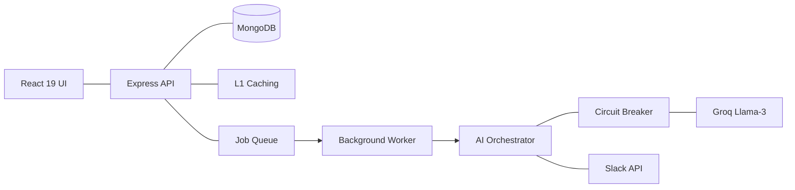

# PM AI Agent - Intelligence-Driven Project Management

The PM AI Agent is a professional project management assistant designed to automate planning, track execution health, and provide real-time situational awareness. It integrates advanced AI reasoning with project data to bridge the gap between documentation and delivery.

## Project Links
*   Deployment URL: https://project-manager-ai-agent-green.vercel.app/
*   Demo Video: [Link coming soon]

## Status and Stack
*   Project Status: Feature Complete
*   Technical Stack: React 19, Node.js, MongoDB, LangChain.js, Groq Llama-3

---

## Feature Overview

### AI and Intelligence
-   Context-Aware RAG: Ingests documents (PDF, TXT, MD) into a central hub for specific project intelligence.
-   Situational Awareness: Dynamic injection of real-time database state (overdue tasks and blockers) into the AI prompt.
-   Automated Task Generator: Extracts structured plans from project documentation with full dependency mapping.
-   Contextual Onboarding: Interactive walkthrough that navigates the user through the platform features.

### Analysis and Reporting
-   Health Dashboard: A data-driven score calculated from real-time risks and completion velocity.
-   Audit Trails: Persistent logging of critical project actions for enterprise-grade accountability.
-   Smart Integration: Bi-directional Slack intelligence via status alerts and slash commands (/ai-status).

---

## Architecture

The system follows a modular full-stack design optimized for performance and reliability.

### System Flow Diagram

### Engineering Excellence: Scalability and Resilience

The following design patterns were implemented to ensure the application is production-ready:

1.  Non-Blocking Operations
Heavy document analysis is handled via an asynchronous job queue. This ensures the user interface remains responsive while the AI processes large datasets in the background.

2.  Fault Tolerance (Circuit Breaker)
To protect the system from external API outages, a Circuit Breaker pattern wraps all AI calls. It automatically trips after repeated failures to provide graceful fallbacks and prevent system hangs.

3.  Multi-Layer Performance
The system utilizes a 10-minute L1 TTL cache for project intelligence and is architected for L2 semantic caching, significantly reducing latency and API costs.

4.  Stateless Scalability
The API layer is completely stateless, allowing for immediate horizontal scaling across multiple instances behind a load balancer.

---

## Technical Stack

-   Frontend: React 19, Vite, TypeScript, Tailwind CSS, Recharts, Lucide React.
-   Backend: Node.js, Express, MongoDB (Mongoose).
-   Infrastructure: LangChain.js, Groq Llama-3, PDF-Parse, Multer.

## Installation

Consult the repository source for environment configuration (.env) and deployment guides for both the backend and frontend modules.

## Team
-   Divya Adhikari: Frontend Architecture and React Development.
-   Shriyukt Gupta: Backend Engineering and Database Design.
-   Shubhanshi Negi: AI Logic and Prompt Engineering.

## License
MIT
