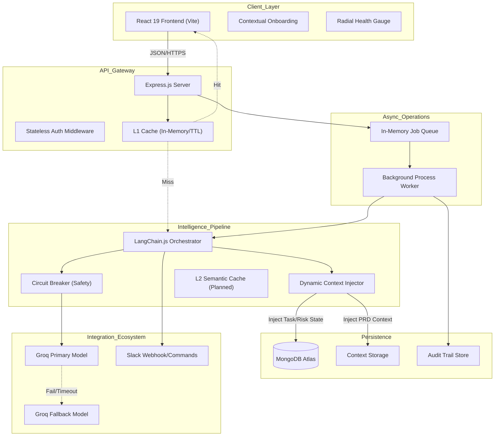

# PM AI Agent - Intelligence-Driven Project Management

The PM AI Agent is a production-grade project management assistant designed to automate planning, track execution health, and streamline team coordination. It leverages Retrieval-Augmented Generation (RAG) and real-time database state injection to provide situational awareness and actionable project insights.

## Project Links
*   Deployment URL: https://project-manager-ai-agent-green.vercel.app/
*   Demo Video: [Link coming soon]

## Status and Stack
*   Project Status: Feature Complete (Hackathon Submission)
*   Technical Stack: React 19, Node.js, MongoDB, LangChain.js, Groq Llama-3

---

## Project Context

Developed to address the overhead of manual planning and reactive risk management, this agent acts as an autonomous intelligence layer. It proactively monitors project health and automates the transition from documentation to execution, ensuring that project managers can focus on strategic decisions rather than administrative chasing.

## Core Capabilities

### Artificial Intelligence
-   Contextual RAG Pipeline: Centralized AI Hub for document ingestion (PDF, TXT, MD) providing project-specific intelligence.
-   Situational Awareness: Dynamic injection of real-time MongoDB state (priorities, deadlines, blockers) into LLM context.
-   Automated Task Generation: Extraction of structured execution plans from project documentation with dependency mapping.
-   Onboarding Wizard: A dynamic, contextual walkthrough with programmatic element targeting for new users.

### Management and Analysis
-   Executive Health Dashboard: Percentage-based health score calculated via risk-weighted algorithms.
-   Audit Trails: Comprehensive activity logging of critical project modifications for enterprise accountability.
-   Unified Task Management: Multi-team filtering across global and project-specific views.

---

## Architecture and Scalability

The application utilizes a modular architecture designed for high availability and low-latency processing.

### Detailed System Diagram

### Scalability and Resilience Patterns

1.  Non-Blocking AI Architecture
The system employs an asynchronous job queue for heavy document processing. By decoupling LLM inference from the HTTP request-response cycle, the application maintains responsiveness. The frontend utilizes a polling pattern to retrieve results upon job completion.

2.  Resilience Engineering (Circuit Breaker)
To prevent cascading failures during AI provider outages, a Circuit Breaker pattern is implemented around LLM calls. If failure rates exceed defined thresholds, the system "trips" to protect core functionality and provides graceful fallbacks.

3.  Multi-Layer Caching Strategy
-   L1 Cache (API Response): Stores processed project intelligence and analytics with a 10-minute TTL to reduce redundant LLM calls.
-   L2 Cache (Semantic): Designed to match semantically similar queries to further optimize API consumption and cost.

4.  Horizontal Scalability
The API is designed to be completely stateless. This allows for horizontal scaling across multiple instances behind a load balancer, supporting high-concurrency environments without session state synchronization issues.

---

## Technical Stack

-   Frontend: React 19, Vite, TypeScript, Tailwind CSS, Recharts, Lucide React.
-   Backend: Node.js, Express, MongoDB (Mongoose).
-   AI Infrastructure: LangChain.js, Groq Llama-3 inference models.
-   Integrations: Slack Web API, PDF-Parse, Multer.

## Installation and Setup

Refer to the repository documentation for detailed environment configuration (`.env`) and local deployment instructions for both the backend and frontend modules.

## Team
-   Divya Adhikari: Frontend Architecture and React Development.
-   Shriyukt Gupta: Backend Engineering, Database Design, and DevOps.
-   Shubhanshi Negi: AI Logic, Prompt Engineering, and Integration.

## License
MIT