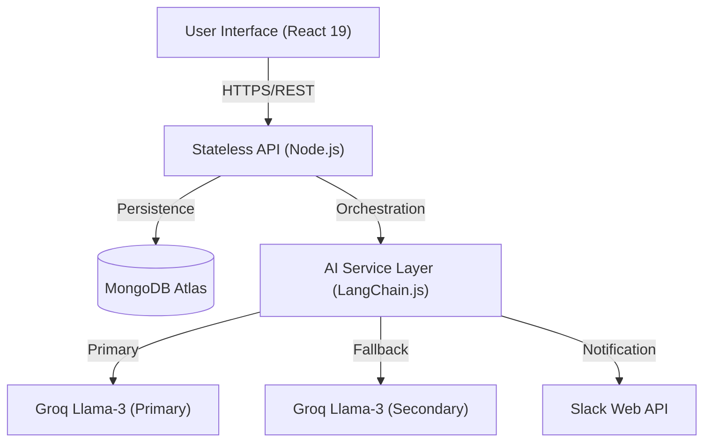

# PM AI Agent - Intelligence-Driven Project Management

The PM AI Agent is an intelligence-driven project management assistant designed to automate planning, track execution health, and streamline team coordination. It leverages Retrieval-Augmented Generation (RAG) and real-time database state injection to provide situational awareness and actionable project insights.


## Project Context

This application was developed to solve core project management challenges: high manual planning overhead, siloed project documentation, and reactive risk management. Our agent acts as an autonomous intelligence layer that proactively monitors project health and automates the transition from documentation to execution.

## Core Capabilities

### Artificial Intelligence
-   Contextual RAG Pipeline: Ingests project documents (PDF, TXT, MD) into a centralized AI Hub to provide document-specific intelligence.
-   Situational Awareness: Dynamic injection of real-time MongoDB state (priorities, deadlines, blockers) into the AI context for accurate advisory.
-   Automated Task Generation: Extraction of structured, actionable tasks directly from project documentation with dependency mapping.
-   Resilient Inference: Implements a Groq-on-Groq fallback strategy combined with a Circuit Breaker pattern to ensure high availability and consistent model behavior.

### Management and Analysis
-   Project Health Dashboard: Executive-level visibility via a percentage-based health score calculated from real-time risks and completion velocity.
-   Audit Trails: Comprehensive activity logging of critical project modifications for enterprise-grade accountability.
-   Unified Task Management: Global and project-specific views with multi-team filtering capabilities.

### Platform Integration
-   Bi-directional Slack Integration: Push emergency status alerts to team channels and query project intelligence via Slack Slash Commands (/ai-status).
-   Smart Inbox: Centralized communication hub with real-time Slack synchronization and high-fidelity fallback demonstration modes.

## Architecture and Design

The application utilizes a modular full-stack architecture optimized for low-latency AI interactions and horizontal scalability.



### Engineering Decisions
-   LangChain.js Implementation: Utilized to unify the stack in TypeScript, ensuring end-to-end type safety and efficient handling of concurrent AI requests via the Node.js event loop.
-   Non-Blocking AI Architecture: Heavy document processing is handled via an asynchronous job queue with a frontend polling pattern to maintain UI responsiveness.
-   Performance Optimization: Integrated L1 Caching for AI analysis results to reduce latency and API consumption costs.

## Technical Stack

-   Frontend: React 19, Vite, TypeScript, Tailwind CSS, Recharts, Lucide React.
-   Backend: Node.js, Express, MongoDB (Mongoose).
-   AI Infrastructure: LangChain.js, Groq Llama-3 inference models.
-   Tooling: PDF-Parse, Multer, Slack Web API.

## Installation

### 1. Clone the Repository
```bash
git clone https://github.com/CyberShadowSensei/Project-Manager-AI-Agent.git
cd Project-Manager-AI-Agent
```

### 2. Backend Configuration
```bash
cd backend
npm install
```
Create a .env file in the backend directory:
```env
PORT=5000
MONGODB_URI=your_mongodb_connection_string
GROQ_API_KEY=your_primary_api_key
GROQ_FALLBACK_KEY=your_secondary_api_key

# Optional: Slack Configuration
SLACK_BOT_TOKEN=your_slack_token
SLACK_INBOX_CHANNEL=your_channel_id
```
Start the server:
```bash
npm start
```

### 3. Frontend Configuration
```bash
cd frontend
npm install
```
Start the development environment:
```bash
npm run dev
```

## Team
-   Divya Adhikari: Frontend Architecture and React Development.
-   Shriyukt Gupta: Backend Engineering, Database Design, and DevOps.
-   Shubhanshi Negi: AI Logic, Prompt Engineering, and Integration.

## License
MIT
