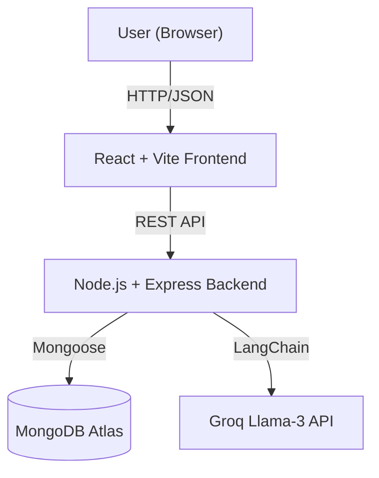

# PM AI Agent

An AI-powered project management dashboard designed to streamline planning, task tracking, and team coordination. It leverages intelligent automation to summarize project status, predict risks, and provide actionable recommendations.

## 🚀 Features

*   **Intelligent Task Management:** Create and track tasks with status updates, priorities, and dependency mapping.
*   **Real-time Project Analytics:** Data-driven visualization of project health, including completion rates and status distribution.
*   **AI Insight Engine:** Proactive risk detection and "Next Best Action" suggestions powered by LLMs (Llama-3).
*   **Unified Dashboard:** A centralized interface for a comprehensive overview of all project metrics and tasks.
*   **Modern UI:** Responsive, dark-themed interface built for clarity and efficiency.

## 🏗️ Architecture

The application follows a modular full-stack architecture for scalability and clear separation of concerns:



*   **Frontend:** React 19, TypeScript, Tailwind CSS, Recharts.
*   **Backend:** Node.js, Express, TypeScript.
*   **Database:** MongoDB Atlas (Mongoose ODM).
*   **AI Engine:** LangChain.js integrated directly into the backend logic for structured analysis.

## 📦 Installation & Setup

1.  **Clone the repository:**
    ```bash
    git clone <repo-url>
    cd pm-ai-agent
    ```

2.  **Install Backend Dependencies:**
    ```bash
    cd backend
    npm install
    ```

3.  **Install Frontend Dependencies:**
    ```bash
    cd ../frontend
    npm install
    ```

4.  **Configuration:**
    *   Create a `.env` file in the `backend/` directory based on `.env.example`.
    *   Configure `MONGODB_URI` and `GROQ_API_KEY`.

## 🏃‍♂️ Running the App

1.  **Start Backend Server:**
    ```bash
    cd backend
    npm start
    ```

2.  **Start Frontend Development Server:**
    ```bash
    cd frontend
    npm run dev
    ```

3.  **Access the Application:** Open your browser and navigate to `http://localhost:5173`.

## 🔮 Future Goals

*   **Advanced Workspace Management:** Implementation of multi-tenant environments for different teams.
*   **Granular Activity Logging:** Comprehensive audit trails for project and task modifications.
*   **AI-Powered Document Ingestion:** Direct task generation from uploaded project documentation (PRDs/Specs).
*   **Platform Integrations:** Seamless connectivity with ecosystem tools like Slack, Jira, and Trello.

## 🤝 Contributors

*   **Divya Adhikari:** Frontend UI/UX & React Components.
*   **Shriyukt Gupta:** Backend API, Database Architecture & DevOps.
*   **Shubhanshi Negi:** AI Logic, Prompt Engineering & LangChain Integration.
